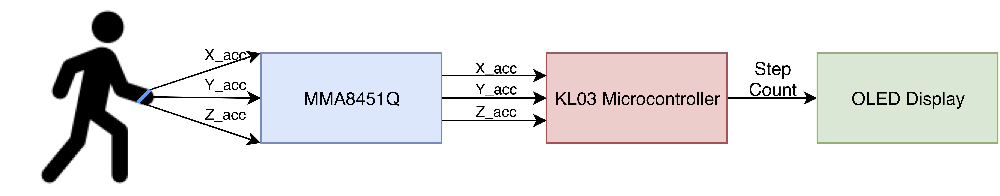
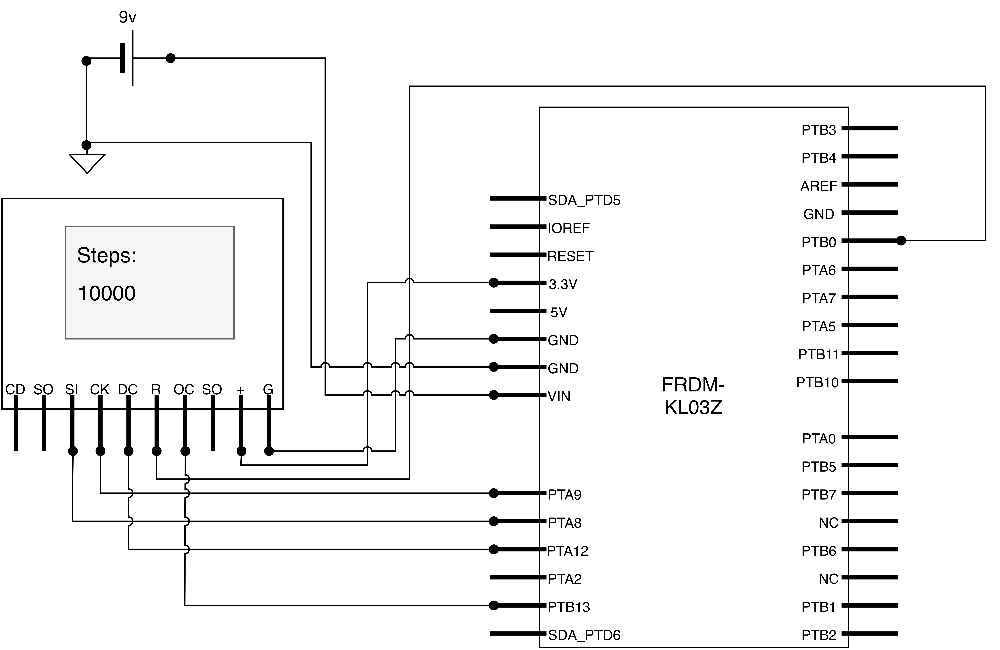

# Design and Implementation of a Three Axis Digital Pedometer
### Kayla-Jade Butkow (kjb85)
### Magdalene College

## Project Overview
This repository presents a digital pedometer implemented on the FRDMKL03 board using the Warp firmware. The pedometer uses the MMA8451Q digital three axis accelerometer to obtain acceleration data. The resultant step count is printed onto an OLED display.

The overall system block diagram is as follows:

A flowchart for the algorithm used to identify steps is given below.

The circuit diagram for the pedometer is provided below.

An image of the final device implementation is provided below.

## Layout of the repository

### Firmware
All of the edited firmware lies in  `src/boot/ksdk1.1.0/`. The files that were edited are as follows:
- devSSD1331.h
- devSSD1331.c
- devMMA8451Q.h
- devMMA8451Q.c
- warp-kl03-ksdk1.1-boot.c
- CMakeLists.txt

Additionally, the following files were added to the firmware in `src/boot/ksdk1.1.0/`:
-  pedometer.h
-  pedometer.c

All files relating to the other sensors in the firmware were removed to increase the available memory on the device

Other files that were edited include: 

- `tools/scripts/jlink.commands`: Changed path to firmware
- `build/build.sh`: Added pedometer files to build script and removed files for other sensors

### Documentation
- [Documentation](https://github.com/kayjayB/Warp-firmware/tree/master/Documentation): Contains the project report and appendices. 
  - [Appendices.pdf](https://github.com/kayjayB/Warp-firmware/blob/master/Documentation/Appendices.pdf): Contains the circuit diagram andphotographs of the hardware
- [Images](https://github.com/kayjayB/Warp-firmware/tree/master/Images): Contains the images displayed in the README
